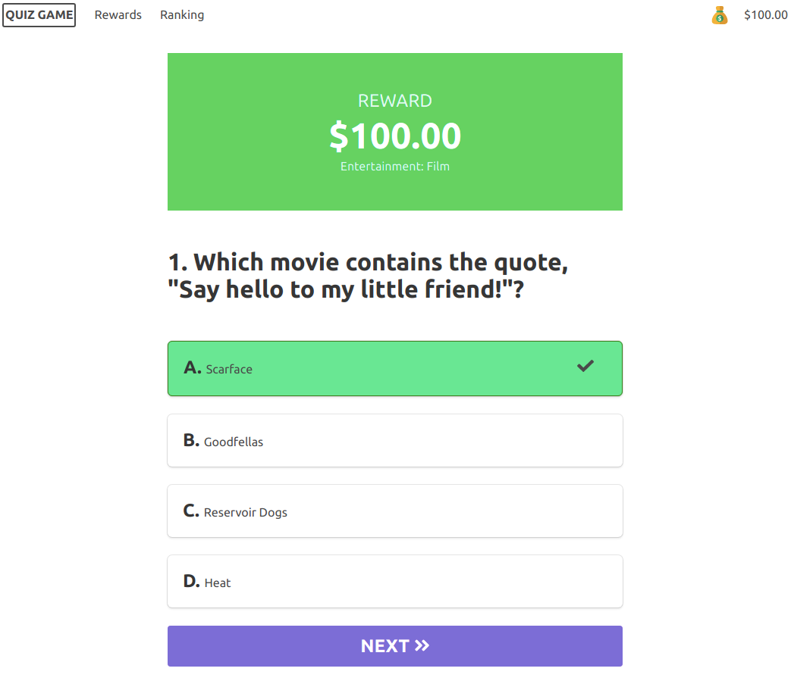

<pre align="center">
   ___               _             ______                             
 .'   `.            (_)          .' ___  |                            
/  .-.  \  __   _   __   ____   / .'   \_|  ,--.   _ .--..--.  .---.  
| |   | | [  | | | [  | [_   ]  | |   ____ `'_\ : [ `.-. .-. |/ /__\\ 
\  `-'  \_ | \_/ |, | |  .' /_  \ `.___]  |// | |, | | | | | || \__., 
 `.___.\__|'.__.'_/[___][_____]  `._____.' \'-;__/[___||__||__]'.__.' 
</pre>



## About
Test your General Knowledge in different types of topics. This game is inspired on the show <i><b>"who wants to be a millionaire?"</b></i>. You must answer correctly 15 questions to become a millionaire. Difficulty ascends as you progress in the game and questions and their categories are randomized each time you start a new match. At the end of your playthrough you can optionally register your score in the ranking, however only the top 10 results will be displayed. Have fun! :grinning:

## Chanllenge
At the begining of 2020, I decided to improve my frontend skills in order to gain more experience as a Full Stack Developer. I've been learning VueJS since January 2020 and this project is a result of my studies so far. :beginner:

## Data source for questions
https://opentdb.com/api_config.php

## Gameplay demo
https://quiz.albertokato.com.br/

## Technologies
<ul>
  <li>
      VueJS

  </li>
  <li>
      Vuex
  </li>
  <li>
      Vue Router
  </li>
  <li>
      Buefy
  </li>
  
  <li>
      Axios
  </li>
  <li>
      Docker 
  </li>
  <li>
     Firebase
  </li>
</ul>

## Requirements for local setup
Download and Install npm.

## Project setup
```
npm install
```

### Compiles and hot-reloads for development
```
npm run serve
```

### Compiles and minifies for production
```
npm run build
```

### Customize configuration
See [Configuration Reference](https://cli.vuejs.org/config/).

## Creator
**Alberto Kato**
- <https://albertokato.com.br>
- albertokatojr@gmail.com
- <https://github.com/ASKJR>


